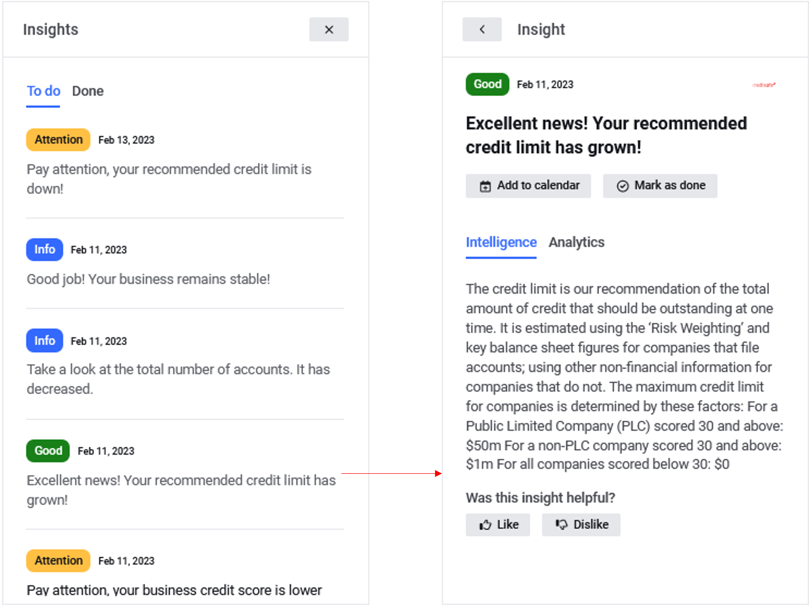

# Integrations

## View Integration pools

The section is intended for managing the landing pages and the list of systems that the client will share in making applications for products and managing the client’s motivation to share his data. The system administrator can create rules for displaying systems and motivation levels for each landing page and product within the section.

## Add new pool

The section is intended for managing the landing pages and the list of systems that the client will share in making applications for products and managing the client’s motivation to share his data.&#x20;

## What is Service Instance

The section is intended for managing the landing pages and the list of systems that the client will share in making applications for products and managing the client’s motivation to share his data. The system administrator can create rules for displaying systems and motivation levels for each landing page and product within the section.

<figure><figcaption></figcaption></figure>

## <mark style="color:blue;">Demo:</mark> How to create Integration instance

<figure><figcaption></figcaption></figure>

## <mark style="color:blue;">Demo:</mark> How to manage Integration benefits


