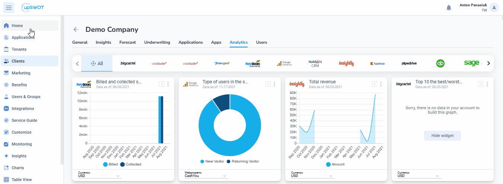

# Service Guide

## Navigating Service Instances

Each category of systems contains a list of providers indicated in the top-right corner as a number. In addition, each category contains a list of providers whose integrations with services allow customers to send their data to the bank.

## Auth parameters

Each category of systems contains a list of providers indicated in the top-right corner as a number. In addition, each category contains a list of providers whose integrations with services allow customers to send their data to the bank.

## Data Anonymization

Each category of systems contains a list of providers indicated in the top-right corner as a number. In addition, each category contains a list of providers whose integrations with services allow customers to send their data to the bank.

About <mark style="color:purple;">Personally Identifiable Information (PII)</mark>

* **Original value** – the value from the third-party app is transferred to the anonymized JSON file as it is, i.e., without encryption
* **HASH** – the value from the third-party app is transferred to the anonymized JSON file with the encryption procedure applied to it. The SHA-256 algorithm is used
* **Random** – a random value is written to the specified field in the anonymized JSON file.

## <mark style="color:blue;">Demo:</mark> How to set up Service Authorization parameters

<figure><figcaption></figcaption></figure>
