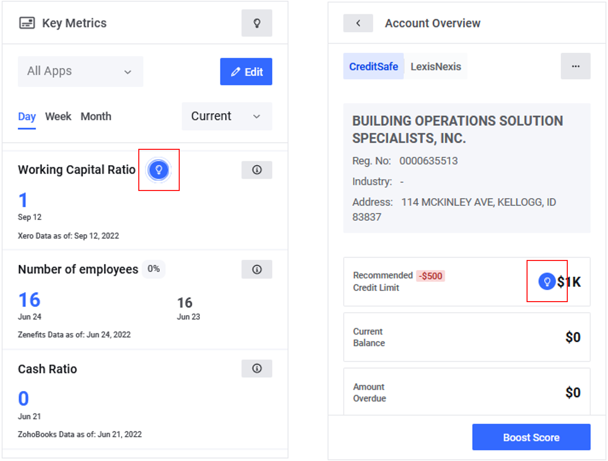

# Users & Groups

## Users and Permissions

This section describes how to manage **Users** and **Groups** in the upSWOT app. Both **Users** and **Groups** define user roles that specify permissions to the upSWOT feathers, beginning from view-only access and up to full administration privileges. Anyone who wants to use and interact with upSWOT must have a user account. Only an authorized administrator can add, edit, and delete a user or a group in the upSWOT app.

<figure><figcaption></figcaption></figure>

## Out-of-the-box Roles

This section describes how to manage **Users** and **Groups** in the upSWOT app. Both **Users** and **Groups** define user roles that specify permissions to the upSWOT feathers, beginning from view-only access and up to full administration privileges. Anyone who wants to use and interact with upSWOT must have a user account. Only an authorized administrator can add, edit, and delete a user or a group in the upSWOT app.

* <mark style="color:yellow;">**Role 1**</mark>
* <mark style="color:yellow;">**Role 2**</mark>
* <mark style="color:yellow;">**Role 3**</mark>

## <mark style="color:blue;">Demo:</mark> How to create a new user


Watch our video tutorial [here](https://youtu.be/Oz5hNemSdWc)


<figure><figcaption></figcaption></figure>

## <mark style="color:blue;">Demo:</mark> How to create a new group

<figure><figcaption></figcaption></figure>

## What is Entity&#x20;

This section describes how to manage **Users** and **Groups** in the upSWOT app. Both **Users** and **Groups** define user roles that specify permissions to the upSWOT feathers, beginning from view-only access and up to full administration privileges.&#x20;

## Scope of rights

This section describes how to manage **Users** and **Groups** in the upSWOT app. Both **Users** and **Groups** define user roles that specify permissions to the upSWOT feathers, beginning from view-only access and up to full administration privileges.&#x20;

## <mark style="color:blue;">Demo:</mark> How to set up User/Group Permissions

<figure><figcaption></figcaption></figure>
