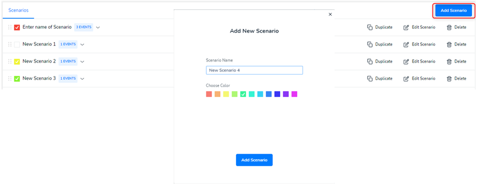

# Forecast Builder

## View forecasts

Forecast builder is a tool intended for managing and forecasting various company metrics for multiple business scenarios.

## Cashflow scenarios

> Basic Scenario is the basic metric forecasted, not including additional scenarios. It is calculated automatically for the 4 previous months (historical data) and 6 next months on a daily basis if you connect one of the accounting systems: Qbs, QBs Desktop, Xero, Zoho Books, Sage, FreshBooks, Free agent.

User scenario is the forecast of the behavior of business metrics, for the next 6 months by days. Created by the user, not by the system.

<figure><figcaption>
Scenarios
</figcaption></figure>

<strong>The forecast process</strong> consists of several steps

* Connect the app which data will take part in the forecast. In order to do that, you need to go to the Forecast Builder section (the list of business forecasts) or Apps section and click the Connect Apps button.
* Add scenarios, which join a lot of events connected by a certain sequence. In order to do that, click the Add Scenario button, enter the scenario name and select a color for all the events of the created scenario.

## <mark style="color:blue;">Demo:</mark> How to add Forecast scenario

<figure><figcaption></figcaption></figure>
