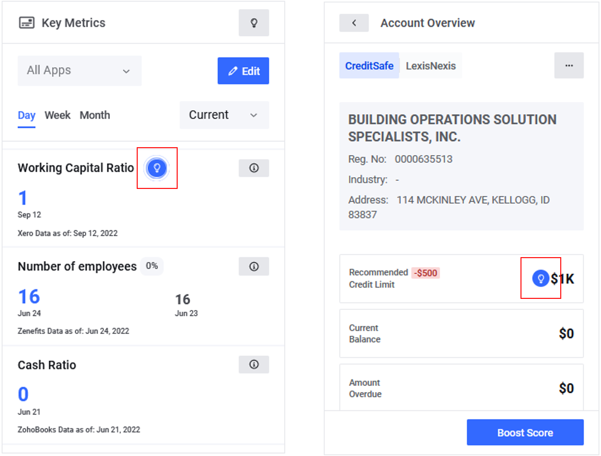

# Insights

## Insights feed

Insights offer the most efficient and simple way to understand your business. Based on Machine Learning, our Monitoring System identifies trends and patterns to let you know as soon as any important activity happens.

<figure><figcaption></figcaption></figure>

## Cashflow forecast

<mark style="color:yellow;">**Apps**</mark> <mark style="color:yellow;"></mark><mark style="color:yellow;"></mark> menu. Insights interpret data in narrative form, they give hints on the next steps and suggestions from the bank. They are the most effective and easy way to understand a business. Insights are generated at the moment when a given threshold is exceeded.

## KPIs

> _<mark style="color:purple;">**KPIs**</mark>_ <mark style="color:purple;"></mark><mark style="color:purple;"></mark> (Key Performance Indicators) are measurable values that demonstrate how effectively a client’s company achieves key business objectives. For example, weekly sales, monthly employee turnover rate, and number of new users per day – all these are examples of KPIs.

## <mark style="color:blue;">Demo:</mark> How to manage Insights


