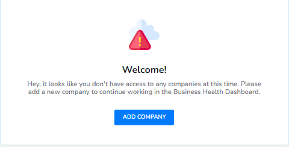

# User Flow

## **Admin Panel Preferences** 

In order to have the possibility to add a new company via SMB Dashboard, you need to be sure that this option is turned on in the Admin panel. Follow the next steps:

1. Open Admin Panel.
2. Go to **Customize** menu.
3. Set **Add New Company** checkbox active if it is not.
4. Click the **Save** button.

To see the result of this setting, the SMB Dashboard page should be refreshed.

### **Create New Entity** 

When you join the SMB Dashboard for the first time, in the process of connecting with apps, you will be asked to add a company to the Business Health Dashboard.

<figure><figcaption></figcaption></figure>


You may apply personalized settings later using [**Settings**](../../../dashboard/v2-smb-dashboard/tutorials/settings.md).


### <mark style="color:blue;">Demo:</mark> How to add Business entities  

<figure><figcaption></figcaption></figure>
